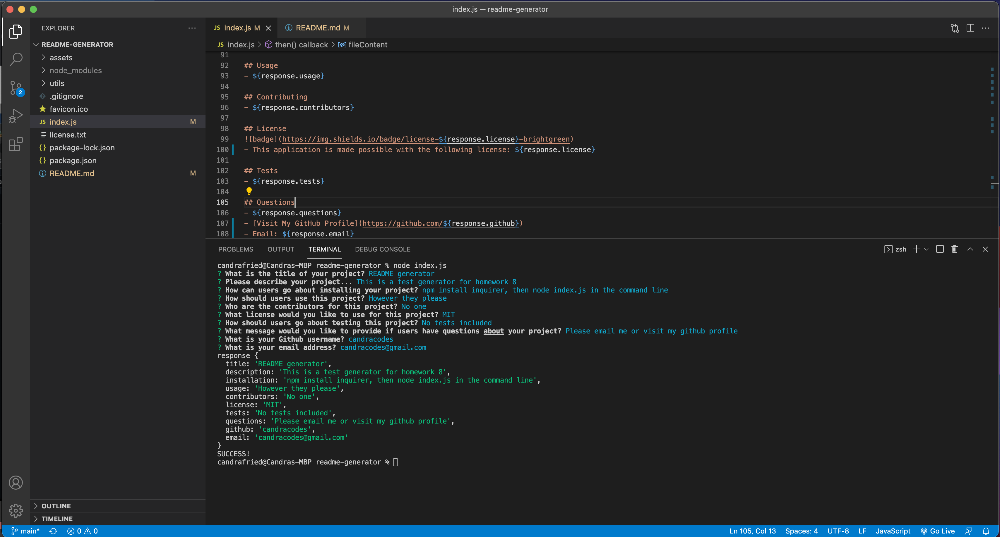

# README Generator
When creating an open source project on GitHub, it’s important to have a high-quality README for the app. This should include what the app is for, how to use the app, how to install it, how to report issues, and how to make contributions. This application quickly creates a README file by using command-line prompts.

## Table of Contents
- [Important URLs](#urls)
- [Foreword](#foreword)
- [Usage](#usage)
- [User Story](#user-story)
- [Acceptance Criteria](#acceptance-criteria)
- [Mockup](#mock-up)
- [Frameworks](#frameworks)
- [License](#Licensing)

## URLs
- [GitHub Repo URL](https://github.com/candracodes/readme-generator)
- [Video Walkthrough](https://watch.screencastify.com/v/bcFi5F0nNPIliza41fK3)

## Foreword

- This application aims to accomplish the following:
  - [Adhere to the homework Acceptance Criteria](./assets/_guide/README.md)
  - Ask the user the following README file generation questions: 1. Title of their application, 2. Description of their application, 3. Table of Contents, 4. Installation, 5. Usage Information, 6. License, 7. Contributing, 8. Tests, and 9. Questions
  - Provide a video walkthrough of this application's workflow
  - Generate a README file after running the comman `node index.js` in the command line, and answering command line prompts
  - Include any other necessary screenshots

## Usage

- This application generates a README file when entering the following in the command line: `node index.js`

## User-Story

```md
AS A developer
I WANT a README generator
SO THAT I can quickly create a professional README for a new project
```

## Acceptance-Criteria

```md
GIVEN a command-line application that accepts user input
WHEN I am prompted for information about my application repository
THEN a high-quality, professional README.md is generated with the title of my project and sections entitled Description, Table of Contents, Installation, Usage, License, Contributing, Tests, and Questions
WHEN I enter my project title
THEN this is displayed as the title of the README
WHEN I enter a description, installation instructions, usage information, contribution guidelines, and test instructions
THEN this information is added to the sections of the README entitled Description, Installation, Usage, Contributing, and Tests
WHEN I choose a license for my application from a list of options
THEN a badge for that license is added near the top of the README and a notice is added to the section of the README entitled License that explains which license the application is covered under
WHEN I enter my GitHub username
THEN this is added to the section of the README entitled Questions, with a link to my GitHub profile
WHEN I enter my email address
THEN this is added to the section of the README entitled Questions, with instructions on how to reach me with additional questions
WHEN I click on the links in the Table of Contents
THEN I am taken to the corresponding section of the README
```

## Mock-Up

* This portfolio resembles the following screenshot:

- 
- [Video Walkthrough](https://watch.screencastify.com/v/bcFi5F0nNPIliza41fK3)

## Frameworks

The project is created using the following frameworks and libraries

- [Node.JS](https://nodejs.org/en/)

## Licensing
The project is made possible with the following Licensing:
- [MIT](license.txt)

